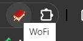
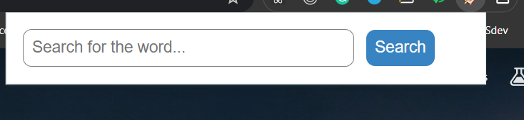
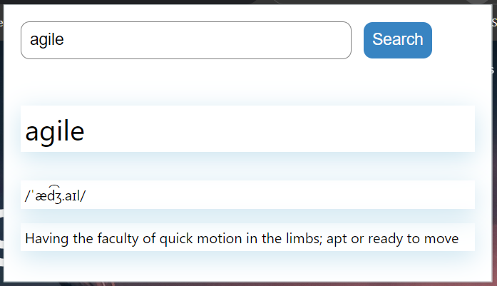
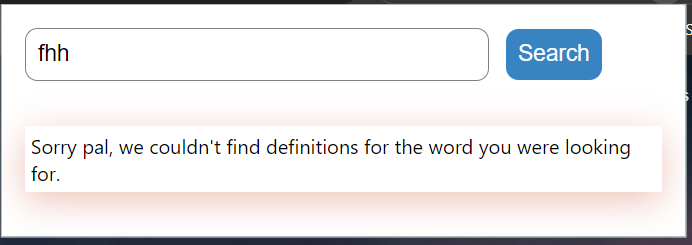

# WoFi - Word Find

A google chrome extension that helps in searching meaning of words.

## Getting Started

### Installing

Clone the repository.

```
git clone https://github.com/aayushsrivastava9760/WoFi.git
```

### Setting up the Extension

1. Open the extension page in google chrome. ( Follow any of the way given below )
**Option 1:** Type `chrome://extensions` in the URL bar and press enter.
**Option 2:** Click on the three dots in the top right of the browser, then click "More Tools" then click "Extensions".

2. Turn on the switch on the top right of the page that says "Developer mode".

3. Click on the button on the top left of the page that says "Load unpacked".

4. Then select the folder `WoFi` which contains the `manifest.json` file.

### Extension Usage

1. Click on the extension icon in the extensions.



2. A popup will appear at the top, enter the word and click Search.



3. The result will be displayed.




## Author

- **Aayush Srivastava**

### Aknowledgements

- Free Dictionary API used by the extension for searching meaning of the words [meetDeveloper/freeDictionaryAPI](https://github.com/meetDeveloper/freeDictionaryAPI).

### Resources

- https://dictionaryapi.dev/
- https://bashvlas.com/blog/install-chrome-extension-in-developer-mode/